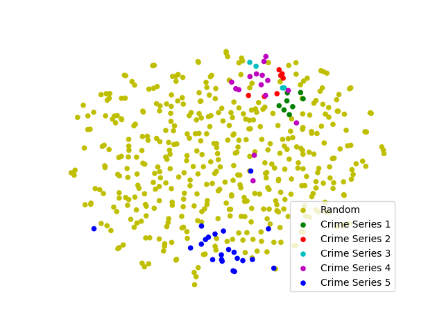
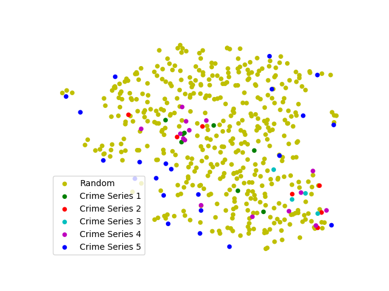

Crime Pattern Detection for Atlanta Police
===

Introduction
---
**holmes** is simple Python package that can do similarity query on crime records rapidly. It majorly requires [gensim](https://radimrehurek.com/gensim/index.html), [nltk](http://www.nltk.org/), [tfrbm](https://github.com/meownoid/tensorfow-rbm) and some other basic Python denpendencies.

The basic idea of **holmes** is extracting critical crime pattern embeddings as criminal features, and measuring their correlations subsequently. The difficulties of this topic lies on the feature engineering and how to retrieve their similarities at a high rate of speed. 

How to Use It
---
Below is a example for how to do a similary query on crime record "16002085701":
```shell
sudo python -m holmes.scripts.score \
	-q 16002085701 \
	-c conf/text.ini \
	-n 5
```
`-q` or `--query_id` is the input crime record id for querying. `-c` or `--config` is the path of the ini configuration file. `-n` or `--num` is the top `n` results that you want it return. 

The expected output is shown as the follow:
```
[2017-10-25T21:54:55.578147+00:00] Ids list has been loaded ['170152495', '170160001', '170160059', '161881787', '161901350']... .
[2017-10-25T21:54:56.219877+00:00] The query narratives is {         On 1-5-2016 I Ofc. XXX was dispatched to 1751 XXXX St regarding a stolen vehicle. Upon my arrival I noticed a white in color Toyota Camry parked on the wrong side of the street. I approached the vehicle and noticed that the steering collum was damaged. I then checked the status of the vehicle on ACIC and was informed that it was stolen out of the city on X-X-XXXX and the reporting party is Mr. XXX XXX. I dusted the driver side door for prints and was able to pull one between the window and the handle. S&W came on scene to remove the vehicle while I took it off the system.}.
[2017-10-25T21:54:56.285879+00:00] The query has been tokenized as: ['152016', 'ofc', 'pressley', 'dispatched', '1751']... .
[2017-10-25T21:54:56.308519+00:00] Dictionary has been loaded Dictionary(74945 unique tokens: [u'darryle', u'fawn', u'tajudeen', u'schlegel', u'nunnery']...)
[2017-10-25T21:54:56.308716+00:00] The query has been converted into BoW as: [(1558, 1), (4482, 1), (4686, 1), (9785, 1), (12651, 1)]... .
[2017-10-25T21:54:56.359254+00:00] Well-trained indexings has been loaded.
[2017-10-25T21:54:56.471826+00:00] Performed a similarity query against the corpus.

The results is output to the stdout. 
[('160020865', 0.42382765), ('162250747', 0.38998085), ('160131778', 0.37461773), ('153041309', 0.35186708), ('160412474', 0.35050681)]
```

Set Up Running Environment
---

#### 1. Install NLTK and download the required NLP resources (e.g. english stopwords and so on)
NLTK is a commonly-used NLP Python toolkit. It includes various of fundamental NLP operations and classic corpus resource. 
- [NLTK installation](http://www.nltk.org/install.html)
- [How to download resource by NLTK](http://www.nltk.org/data.html)

#### 2. Install tfrbm package manually
Since the tfrbm is a trd-party RBM package I choosed to use, which is not available on pip source for the time being, you have to install the package manually by running:
```shell
# tensorflow has been properly installed.
cd /root/path/of/the/project
sudo pip install tfrbm/
```

#### 3. Configuration settings.
You have to configure settings for model and database connections in an INI file. And the INI file will be passed in as a parameter of the python command shown above.
The following is a concrete example for the configurations in an INI file:

```ini
[Model]
pruned_dict_path: resource/simple.corpus/universe_pruned.dict
id_info_path: resource/simple.corpus/info.txt
index_path: resource/index/correlation

[Database]
driver: ODBC Driver 13 for SQL Server
server: tcp:example_server.database.example_companycouldapi.net,example_port
database: example_database_name
uid: example_uid
password: example_password
```

The settings for database connection are straightfoward as shown in the example. In addition, you have to indicate the paths for required resource file, including:
- **pruned_dict_path**: It's a dictionary file defined by gensim, details are referred to [gensim.corpora.dictionary](https://radimrehurek.com/gensim/corpora/dictionary.html)
- **index_path**: It's a similarity file defined by gensim, details are referred to [Similarity Queries](https://radimrehurek.com/gensim/tut3.html)
- **id_info_path**: It's a text file that contains the ids information of the training dataset. 

Performance on Real Data
---
Our package has a inspiring performance on the real dataset currently. We also did a comparison between our method and conventional LDA, which reveals a great advantage over the LDA. 


> Results by our method


> Results by the LDA


